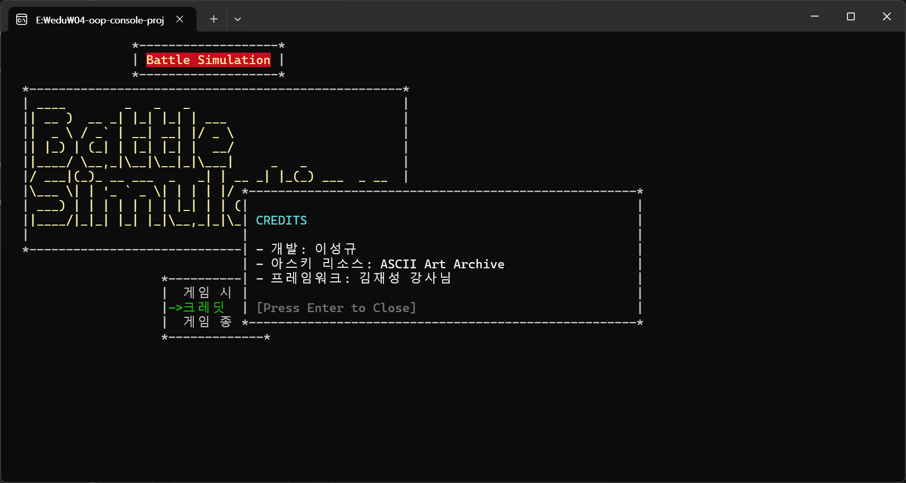
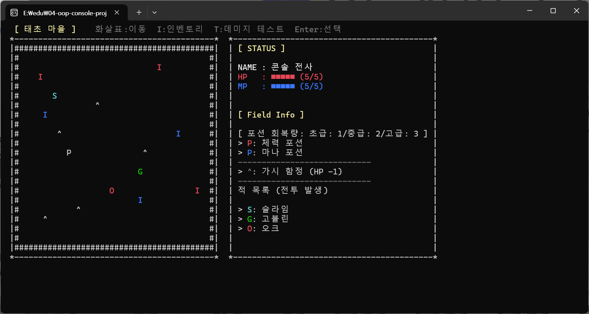
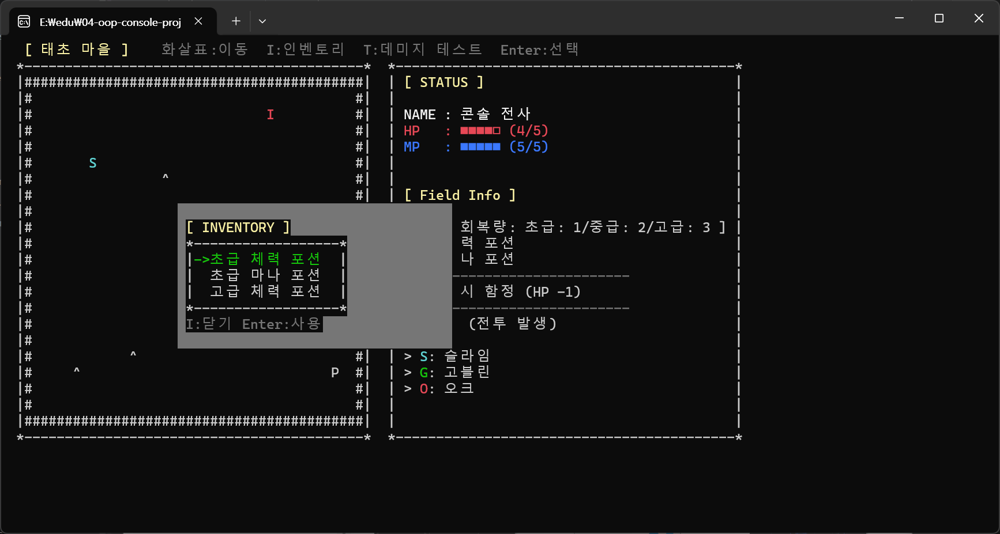
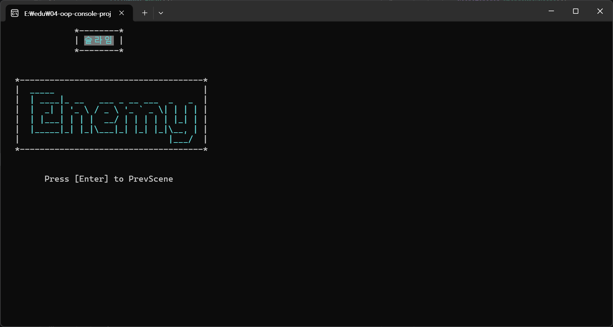
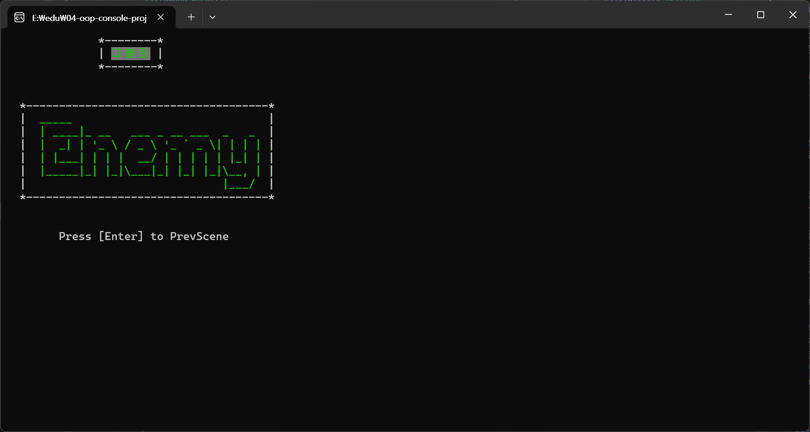
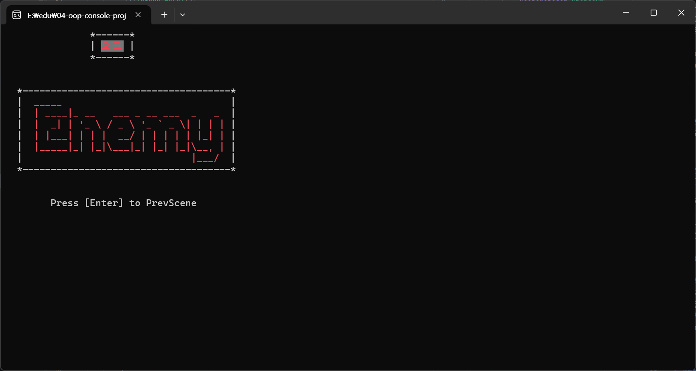

# BattleSimulation C# 콘솔 RPG 프로젝트 개발 문서

## 1. 프로젝트 개요

이 프로젝트는 C# 콘솔 환경에서 실행되는 RPG 게임으로 제공 받은 프레임 워크의 구조를 따라 구현하며 게임 콘텐츠의 구현보다는 **화면 깜빡임(Flickering)과 입력 지연**등 쾌적한 유저 경험과 깔끔한 렌더링으로 시각적 만족감에 중점을 두고 개발하였다.

### 작업 후기

렌더링을 신경쓰며 콘솔 차원에서 다루는 것에 어려움과 일일히 모든 과정을 파악하는 과정에서 시행 착오와 시간 소모도 겪으며 엔진이 없는 환경에서 다양한 최적화 기법을 시도했고 그려지는 과정을 파악하는 것이 유익했다.

## 2. 핵심 렌더링 로직 및 최적화

**2.1. 게임 루프 구조 개선**
기존의 `Draw → Input → Update` 순서가 아닌, **`Input → Update → Render`** 순서로 렌더링 과정을 재설계하여 입력 반응성을 높이고 불필요한 연산을 줄였다.
- 그 대신 코드를 짜고 렌더링을 돌릴때 신경써줘야하는 것이 늘었지만 좋아진 퀄리티의 화면과 성능을 챙길 수 있었다.

**2.2. 더티 플래그 (Dirty Flag) 패턴**
매 프레임 화면을 무조건 다시 그리는 것은 성능에 악영향을 끼친다. `NeedsRedraw`라는 변수를 도입하여, 플레이어의 이동이나 상태 변화가 있을 때만 `Render` 메서드가 호출되도록 제한했다. 이를 통해 화면의 갱신이나 깜박임을 최소화 했다.

**2.3. 렌더링 퍼포먼스 최적화**

* **StringBuilder 도입:** `Console.Write`를 여러 번 호출하는 대신, 문자열을 조합한 뒤 한 번에 출력하여 성능 부하를 줄이고 렌더링 속도를 높였다.
* **부분 렌더링:** 이동 시 맵 전체를 지우지 않고, 캐릭터가 있던 자리(이전 좌표)와 이동한 자리(현재 좌표)만 갱신하는 방식을 적용하여 쾌적한 유저 경험과 성능을 챙겼다.

## 3. 주요 콘텐츠 및 기능

**3.1. 씬(Scene) 종류**

* **TitleScene:** 아스키 아트를 활용한 로고 출력과 게임 시작 메뉴. 게임 시작, 크레딧창 출력, 게임 종료의 기능이 있다.
  
  **타이틀씬**
  
  **크레딧창**
* **TownScene:** 게임의 주 무대. 플레이어는 맵을 탐험하며 포션(HP/MP)을 획득하거나 함정을 피하고, 적과 조우할 수 있다. 우측 UI 패널을 통해 실시간 상태 정보와 맵의 요소를 설명한 정보를 확인할 수 있다.
  
  **TownScene(맵과 정보창)**
  
  **인벤토리**

* **BattleScene:** 적과 부딪히면 전환되는 전투 화면.
* 우선 색상 구현
  * 아직 미구현. 적 색상에 따라 아스키 아트 및 적 이름 색상 변경 구현, 전투를 끝내면 이전 맵(TownScene)으로 돌아간다.
 
  
  
  

**3.2. 인벤토리 시스템**
인벤토리는 별도의 씬으로 넘어가는 것이 아니라, 현재 맵 위에 팝업 형태로 뜨는 **오버레이 UI** 방식.

* **화면 렌더링 복구 로직:** 인벤토리 창을 닫을 때 `Console.Clear`로 전체를 지우는 것이 아니라, 인벤토리 창이 가리고 있던 맵의 영역 계산하여 다시 그려준다. 이를 통해 잔상 없는 깔끔한 UI 경험을 제공.
  * 구현 과정에서 많은 시행착오를 겪으면서 여러가지 경우의 수를 체크하게 되고 그에 따라 도달한 것이 지금의 방식. 렌더링 시스템과 신경쓸 것이 많아 가장 시간을 많이 소모함.

**3.3. 적(Enemy) 시스템**

* **팩토리 패턴:** `Enemy.Create` 메서드와 열거형(`Enum`)을 사용하여 슬라임, 고블린, 오크 등 다양한 적을 손쉽게 생성하고 배치할 수 있다.
* **시각적 요소:** 적의 종류에 따라 콘솔 출력 색상(Cyan, Green, Red 등)과 심볼을 다르게 적용하여 가시성을 높였다.

## 4. 조작 방법

* **화살표:** 캐릭터 이동 및 메뉴 선택
* **Enter:** 선택, 공격, 확인
* **Esc:** 전투 중 도망가기
* **I 키:** 인벤토리 열기/닫기
* **T 키:** (테스트용) 체력 감소

## 5. 문제 해결 과정 (개발 과정의 문제 해결)

**문제 1: 화면 깜빡임 현상**

* **원인:** 매 프레임 `Console.Clear()`를 호출하여 화면 전체를 지웠다 그리는 방식 때문이었습니다.
* **해결:** 씬 진입 시에만 화면을 지우고, 이후에는 변경된 위치에 커서를 옮겨 덮어쓰는 방식으로 변경하여 해결했다.
  * 키 입력 및 이동이 일어나는 순간에도 전체 화면 다시 그리는 것이 아닌 변하는 요소만 덮어쓰기.
    * 필요에 따라 전체 화면 재출력 호출(최소한으로)
  * 시간의 문제로 성능 저하가 크지 않은 타이틀씬의 개선은 미뤄둔 상태.(메뉴키 이동시 전체화면이 다시 그려지는 상태)

**문제 2: 씬 전환 시 크래시 (NullReferenceException)**

* **원인:** 적과 닿아서 `BattleScene`으로 전환될 때, `TownScene`의 데이터가 해제(`null`)되었음에도 플레이어의 이동 로직이 계속 실행되어 발생했다.
* **해결:** 이동 메서드 내에 `Field` 데이터가 `null`인지 체크하는 방어 코드를 추가하여, 씬 전환 즉시 이동 로직을 중단시키도록 수정했다.

**그 외 다수:** 다수의 문제 직면 및 해결 기록을 Github의 README 문서에 작업노트로 상세히 기술하였다. 작업하며 실시간으로 적은 노트라 상세히 기록 되어 있다.
[README 작업 노트](https://github.com/Kyungil-smart/04-oop-console-project-dev-LS-archive/blob/main/README.md)

## 6. 향후 확장 가능성
* 인벤토리창에서 아이템 설명 기능 추가
* 배틀 씬 전환시 데이터 유지
* 배틀 씬에서 아스키 아트를 통한 적 렌더링
  * 리소스를 구하거나 만들기 힘든 방식이 아닌 텍스트를 아스키 아트로 바꾸어 적을 그리는데 사용.
    * 적 HP에 따라 아스키 아트의 색상 변경
    * 타격 시 아스키 아트 색상 변경을 통한 타격 이펙트 연출 등
* 심화 가능성
  * 아스키 아트나 긴 텍스트같은 데이터를 외부 파일에서 불러와 사용 
  * 아스키 아트 리소스 순차 출력을 통한 애니메이션 혹은 배열 순서에 접근하는 애니메이션.